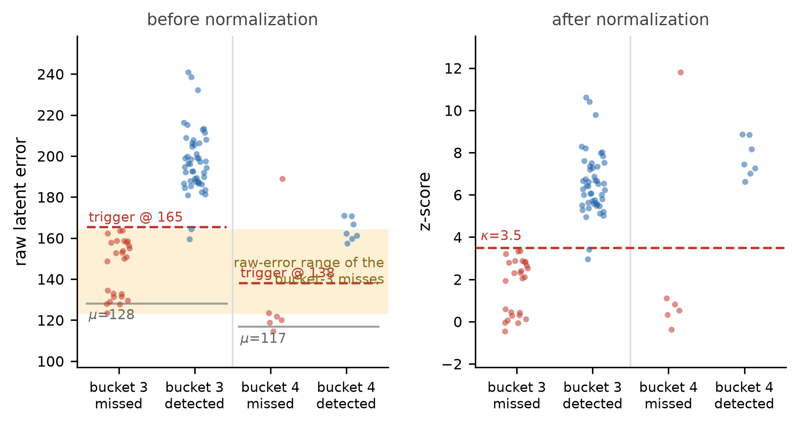
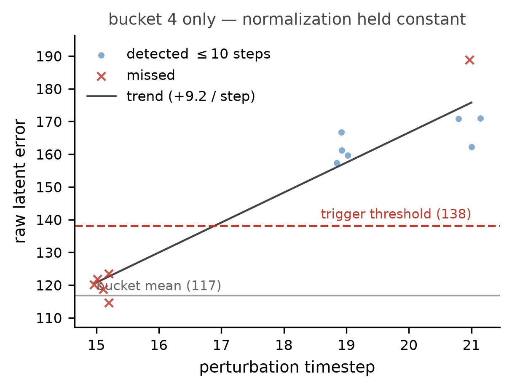
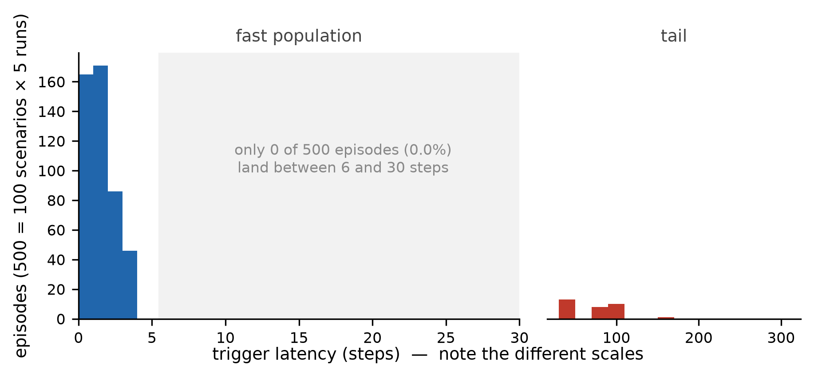

# G1-JEPA

**V-JEPA latent-consistency monitoring for event-driven failure detection and adaptive replanning in robotic manipulation.**

G1-JEPA investigates whether a frozen pretrained video representation can serve as an online **execution-consistency signal** for robotic manipulation.

Rather than replanning periodically, the system monitors visual observations during execution and triggers replanning only when the observed latent dynamics become inconsistent with nominal behavior.

The current work establishes a simulation-based Level-0 baseline using a frozen **V-JEPA 2 ViT-L** encoder and demonstrates that deployment-matched calibration is critical for reliable online triggering.

> **Current status:** The project is designed toward eventual deployment on the Unitree G1 humanoid platform, but all quantitative results currently reported here were obtained in **robosuite + MuJoCo** on a Panda Lift task. The method has not yet been validated on a physical G1 robot.

---

## Motivation

Manipulation policies can fail when the environment changes after an action sequence has already been planned.

For example, if an object is displaced during the robot's descent phase:

* an open-loop controller may continue executing an invalid trajectory;
* periodic replanning can recover but wastes computation even when nothing has changed;
* a visual event detector could instead request replanning only when the execution becomes inconsistent.

This project asks:

> **Can a frozen pretrained video representation provide a sufficiently reliable online inconsistency signal to trigger replanning?**

The goal is not to replace the manipulation policy, but to provide an event-driven monitoring layer that improves disturbance recovery while reducing unnecessary replanning.

---

# Method

## 1. Visual observation

The manipulation environment provides two RGB views:

* `agentview` — third-person scene view
* `robot0_eye_in_hand` — wrist-mounted camera

Images are rendered at `384 × 384`.

The current final detector uses the **wrist view**. Independent representation experiments also evaluate the agent view, while multi-view fusion remains future work.

---

## 2. Temporal clip construction

Online observations are accumulated into a **16-frame video clip**.

```text
RGB observations
      │
      ▼
16-frame temporal buffer
      │
      ▼
Frozen V-JEPA 2 encoder
      │
      ▼
Latent representation h[t]
```

The frozen V-JEPA 2 ViT-L encoder contains approximately **326M parameters** and is used in fp16 without task-specific fine-tuning.

A single clip produces a latent representation of shape:

```text
(2048, 1024)
```

corresponding to temporal and spatial video tokens.

Measured encoding time is approximately:

```text
44.4 ms / clip
≈ 22.5 Hz theoretical throughput
```

which is sufficient for the current 10 Hz trigger budget.

---

## 3. Latent consistency prediction

This project intentionally starts from a simple **Level-0 baseline** rather than training an action-conditioned predictor.

The current detector predicts the next latent state using linear extrapolation:

```text
pred[t] = 2 · h[t-k] - h[t-2k]
```

and measures the prediction error:

```text
E[t] = ||pred[t] - h[t]||
```

The final Version A/B configuration uses:

```text
camera       = wrist
aggregation  = grid
metric       = absolute L2
k            = 1
κ            = 3.5
consec       = 1
```

No V-JEPA backbone fine-tuning or action-conditioned latent predictor is used.

This makes the experiment a direct test of whether a pretrained video representation already contains a useful **control-relevant inconsistency signal**.

---

# State-Aware Trigger

Robot execution is divided using the policy state machine:

```text
APPROACH
DESCEND
GRASP
LIFT
```

Instead of normalizing errors globally, the detector uses state-dependent buckets:

```text
bucket =
    phase_id × 3
    + min(phase_step // 6, 2)
```

For each bucket, nominal execution statistics provide:

```text
μ_b = normal latent-error mean
σ_b = normal latent-error standard deviation
```

The online error is converted into:

```text
z[t] = (E[t] - μ_b) / σ_b
```

A trigger occurs when:

```text
z[t] > κ
```

and the configured consecutive-crossing requirement is satisfied.

A hysteresis mechanism prevents immediate re-arming until the signal returns below a lower threshold.

---

# Evaluation Protocol

A central part of this project was maintaining strict separation between configuration selection and final evaluation.

The data roles are:

| Split          | Purpose                                              |
| -------------- | ---------------------------------------------------- |
| Calibration    | Estimate nominal bucket-level statistics             |
| Validation     | Select feature, `k`, `consec`, and `κ`               |
| Version A Test | Frozen configuration evaluated on seeds 5000–5099    |
| Version B Test | Revised calibration evaluated on new seeds 6000–6099 |

Validation performance is not reported as final test performance because the configuration was selected using that data.

For final evaluation, four strategies are compared:

| Strategy      | Description                                                     |
| ------------- | --------------------------------------------------------------- |
| **No Replan** | Executes the original trajectory without replanning             |
| **Fixed**     | Periodically replans on a fixed schedule                        |
| **Oracle**    | Replans using privileged knowledge of the true disturbance time |
| **JEPA**      | Replans when the visual consistency detector triggers           |

Both clean and perturbed episodes are evaluated.

Perturbations consist of a **5–10 cm lateral displacement** applied during the `DESCEND` phase.

---

# Version A

## Initial frozen detector

Version A used calibration statistics computed from offline cached latent trajectories.

On previously unseen test scenarios:

| Metric                         |    JEPA Version A |
| ------------------------------ | ----------------: |
| Perturbed success              |   **0.93 ± 0.02** |
| Clean success                  |          **1.00** |
| Median trigger latency         |        **1 step** |
| P90 trigger latency            | **47 ± 35 steps** |
| Detection ≤10 steps            |   **0.81 ± 0.02** |
| Replans / perturbation         |   **1.12 ± 0.04** |
| Wasted replans / clean episode |   **0.11 ± 0.02** |
| Completion steps               |    **85.2 ± 1.9** |

Version A showed that the visual signal was useful, but it also revealed a severe **long-tail latency failure mode**.

The latency distribution was nearly bimodal:

```text
most detected disturbances
        → trigger within ~5 steps

remaining difficult cases
        → extremely late or never trigger
```

This indicated that mean latency alone was misleading.

---

# Failure Analysis

The most important part of the project was diagnosing why Version A failed.

## 1. Failures concentrated in one state

Of 21 analyzed failure episodes:

```text
17 → DESCEND bucket 3
 3 → DESCEND bucket 4
 1 → DESCEND bucket 5
```

The physical perturbation signal was not substantially weaker in bucket 3.

Instead, the normal error distribution in that bucket had much larger variance:

| Bucket | Region        |   Clean μ ± σ | Perturbed μ |
| ------ | ------------- | ------------: | ----------: |
| 3      | early DESCEND | 150.5 ± 14.72 |       188.2 |
| 4      | mid DESCEND   |  118.1 ± 5.45 |       187.4 |
| 5      | late DESCEND  |  118.7 ± 8.23 |       179.8 |

The same disturbance therefore produced only about:

```text
2.6 σ separation in bucket 3
```

compared with:

```text
12.7 σ separation in bucket 4
```

---

## 2. Threshold tuning did not solve the problem

Several alternatives were tested:

* lower global thresholds;
* empirical per-bucket quantiles;
* selectively relaxed bucket-3 thresholds;
* consecutive-trigger debounce.

None improved the detection/false-positive Pareto frontier.

For example, relaxing bucket 3 improved timely detection only marginally while substantially increasing false positives.

This ruled out **threshold tuning** as the primary solution.

---

# Root Cause: Calibration / Deployment Distribution Mismatch

The key diagnostic finding was that the offline calibration pipeline and the actual online detector did not observe the same temporal support.

Both samples were nominally labeled as the same state bucket, but they represented different portions of the trajectory.

For early DESCEND:

```text
Offline calibration:
    heavily samples t = 16 and t = 18

Online detector:
    first valid z-score ≈ t = 20
```

The online path requires all of the following:

```text
evaluation interval
        +
warm-up requirement
        +
latent-history accumulation
```

before the first valid prediction error can be calculated.

As a result, the offline calibration distribution contained states that the online detector could **never actually observe**.

For bucket 3, the online nominal mean was approximately:

```text
1.34–1.51 σ below
```

the frozen offline calibration mean.

This mismatch simultaneously caused:

```text
bucket 3 → threshold effectively too strict → missed disturbances

other buckets → threshold effectively too loose → false positives
```

The failure was therefore not simply a weak representation or an incorrect threshold.

It was a **deployment-support mismatch**.

---

# Version B: Deployment-Matched Calibration

To correct the mismatch, Version B introduced an **observe-only calibration mode**.

Instead of recalibrating from ordinary closed-loop clean trajectories—which could themselves be altered by false replanning triggers—the system runs the full online detection pipeline:

```text
rendering
  ↓
frame preprocessing
  ↓
temporal buffer
  ↓
V-JEPA encoding
  ↓
evaluation cadence
  ↓
warm-up
  ↓
state bucketing
  ↓
error computation
```

but discards all trigger outputs.

```text
detector trigger
      ↓
ignored
      ↓
controller trajectory remains unchanged
```

This produces calibration statistics from exactly the states the deployed detector can access without allowing the detector to modify its own calibration data.

The resulting configuration is stored in:

```text
exp/calib_deploy_matched.json
```

---

# Final Results — Version B

After calibration was rebuilt, the detector configuration was frozen and evaluated on a **new set of unseen scenarios**.

Results are averages over five independent runs.

| Metric                      |   Version A |       Version B |
| --------------------------- | ----------: | --------------: |
| Perturbed success           | 0.93 ± 0.02 | **1.00 ± 0.00** |
| Detection ≤10 steps         | 0.81 ± 0.02 | **0.94 ± 0.01** |
| Median latency              |           1 |           **1** |
| P90 latency                 | 47.4 ± 34.5 |   **3.0 ± 0.0** |
| Maximum latency             |    220 ± 21 |    **107 ± 35** |
| False-positive episode rate | 0.11 ± 0.02 | **0.09 ± 0.02** |
| Replans / perturbation      | 1.12 ± 0.04 | **1.72 ± 0.04** |
| Completion steps            |  85.2 ± 1.9 |  **76.7 ± 0.8** |

The largest improvement is in the **tail of the trigger-latency distribution**:

```text
P90 latency

Version A     47.4 steps
                  │
                  ▼
Version B      3.0 steps
```

The median remained at one step, showing that Version B did not merely accelerate already-easy cases—it converted many previously late or missed detections into fast detections.

Completion time also improved:

```text
Version A      85.2 steps
Version B      76.7 steps
Fixed          84.6 steps
Oracle         70.8 steps
```

Version B therefore moved from approximately fixed-replanning efficiency toward the oracle upper bound.

---

# Results Figures

## State-dependent detection behavior



The raw-error analysis shows why apparently similar physical disturbances can produce very different normalized trigger scores across execution states.

---

## Timing and support mismatch



Temporal analysis helps identify whether detector failures originate from disturbance magnitude, state geometry, or calibration support.

---

## Trigger latency



The latency distribution highlights the distinction between the dominant fast-detection population and the remaining long-tail cases.

---

# Camera Representation Study

Different viewpoints preferred different latent aggregation strategies.

On validation data under the same false-positive constraint:

| Camera     | Best representation      | Detection | False-positive rate | Median latency |
| ---------- | ------------------------ | --------: | ------------------: | -------------: |
| Wrist      | **4×4 spatial grid**     |      0.94 |                0.02 |         1 step |
| Agent view | **temporal aggregation** |      0.83 |                0.02 |         1 step |

A plausible interpretation is:

* wrist observations contain large, localized object motion, making spatial structure useful;
* third-person observations contain smaller objects, making temporal motion patterns more informative.

This interpretation has not yet been confirmed through a dedicated ablation.

Importantly, **Version B does not yet fuse both cameras**. Measuring conditional cross-view complementarity is part of the next stage of the project.

---

# Replanning Trade-off

Version B improved detection substantially, but it also increased:

```text
replans / perturbation

1.12 → 1.72
```

This increase was traced to a separate implementation issue rather than a looser threshold.

After the first replan, the controller introduces a policy discontinuity. Because the detector still contains pre-replan observations in its 16-frame temporal window, the discontinuity produces another error spike approximately one clip length later.

Typical behavior:

```text
disturbance
    ↓
first JEPA trigger
    ↓
replanning
    ↓
~16 steps
    ↓
artificial second trigger
```

The planned fix is to reset the frame buffer and latent prediction history after replanning, or hold the detector disarmed for one full clip.

This issue is not corrected in the current Version B results.

---

# Experimental Rigor

Several implementation details were found to have a measurable effect on results.

### Deployment-aligned state definitions

Phase labels come directly from the online policy state machine rather than normalized episode progress, ensuring that state information is available during closed-loop execution.

### Reproducible environment sampling

robosuite's `UniformRandomSampler` maintains its own random generator and was not controlled by the global NumPy seed.

The environment sampler is therefore explicitly seeded before `env.reset()`.

### Repeated evaluation

Small floating-point differences in MuJoCo contact dynamics can propagate through the vision encoder and change trigger decisions for threshold-boundary episodes.

Final results are therefore reported as:

```text
mean ± standard deviation
```

over **five independent runs**, rather than relying on a single deterministic evaluation.

---

# Repository Structure

```text
g1-jepa/
│
├── exp/
│   ├── run_episode.py
│   │   └── Closed-loop evaluation
│   │
│   ├── threshold_exp.py
│   │   └── Threshold and debounce experiments
│   │
│   ├── make_calib.py
│   │   └── Deployment-matched calibration generation
│   │
│   ├── calib_deploy_matched.json
│   │   └── Frozen Version B calibration
│   │
│   ├── cmp_calib.py
│   │   └── Offline / deployment calibration comparison
│   │
│   ├── online_vs_calib.py
│   │   └── Online distribution-shift analysis
│   │
│   ├── counterfactual.py
│   │   └── Counterfactual recalibration analysis
│   │
│   ├── fp_check.py
│   │   └── False-positive diagnostics
│   │
│   ├── support_check.py
│   │   └── Temporal-support diagnostics
│   │
│   ├── aggregate.py
│   │   └── Multi-run result aggregation
│   │
│   ├── make_figures2.py
│   │   └── Evaluation figure generation
│   │
│   ├── results/
│   │   └── Episode-level experiment logs
│   │
│   └── figs_vB/
│       └── Final analysis figures
│
└── README.md
```

---

# Example Evaluation

Activate the environment:

```bash
source ~/qiuyu/g1_jepa/exp/go.sh
cd ~/qiuyu/g1_jepa/exp
```

Run the Version B JEPA detector:

```bash
python run_episode.py \
    --n 50 \
    --jepa \
    --kappa 3.5 \
    --consec 1 \
    --seed0 0 \
    --calib calib_deploy_matched.json
```

Episode-level outputs, including trigger statistics and per-step diagnostic information, are written to the `results/` directory.

---

# Environment

| Component          | Configuration                  |
| ------------------ | ------------------------------ |
| Simulator          | robosuite 1.5.2 + MuJoCo 3.2.7 |
| Task               | Panda Lift                     |
| Controller         | OSC_POSE                       |
| Action dimension   | 7                              |
| Cameras            | agentview + wrist              |
| Resolution         | 384 × 384                      |
| Encoder            | V-JEPA 2 ViT-L                 |
| Encoder parameters | ~326M                          |
| Encoder precision  | fp16                           |
| Backbone training  | Frozen                         |
| Rendering          | MuJoCo EGL                     |
| Compute            | NVIDIA RTX 4090 GPUs           |

---

# Limitations

The current results should be interpreted as a proof of concept rather than a finished robot-deployment system.

Current limitations include:

* experiments are simulation-only;
* the system has not yet been deployed on Unitree G1 or another physical robot;
* only one disturbance family is evaluated: a 5–10 cm lateral displacement during DESCEND;
* approximately 6% of Version B disturbances still trigger after 10 steps;
* maximum latency remains large for rare tail cases;
* the false-positive rate did not significantly improve between Versions A and B;
* Version B contains redundant post-replanning triggers caused by the temporal clip window;
* some early APPROACH calibration buckets remain unavailable after replanning;
* deployment-matched calibration has relatively few samples in some state buckets;
* Version A and Version B use different test scenario sets and therefore are not strictly paired;
* multi-view fusion has not yet been implemented.

---

# Next Steps

### 1. Remove redundant post-replanning triggers

Reset the visual and latent history when replanning occurs so that the predictor does not span a controller discontinuity.

### 2. Measure cross-view complementarity

Evaluate:

```text
P(agentview detects | wrist misses)
```

rather than comparing only overall camera accuracy.

If the agent view specifically covers early wrist-camera failures, it can provide useful complementary information despite lower overall detection performance.

### 3. Geometry-aware multi-view fusion

If complementarity is confirmed:

```text
far / early phase
      → emphasize agent view

near-object phase
      → emphasize wrist view
```

### 4. Improve calibration coverage

Increase observe-only calibration data for sparsely sampled state buckets and add missing early APPROACH statistics.

### 5. Expand perturbations

Evaluate:

* different disturbance magnitudes,
* different task phases,
* multiple disturbances,
* tighter task time limits,
* and additional manipulation tasks.

### 6. Real-robot deployment

Integrate the trigger with a VLA policy and evaluate the complete perception → detection → replanning loop on the Unitree G1 platform.

---

# Key Takeaways

This project provides three main findings.

**1. Frozen pretrained video representations contain useful execution-monitoring signals.**

A task-specific visual encoder was not required to obtain meaningful disturbance detection.

**2. Reliable online detection requires deployment-matched calibration.**

The largest Version A failure mode was not resolved by threshold tuning. It came from a mismatch between the temporal support used for offline calibration and the states actually reachable by the deployed detector.

**3. Failure analysis matters as much as aggregate performance.**

Bucket-level diagnostics, counterfactual replay, support-set analysis, repeated runs, and explicit treatment of false positives revealed failure mechanisms that would have been hidden by success rate alone.

The final Version B detector achieves:

```text
Perturbed success       1.00
Detection ≤10 steps     0.94
Median latency          1 step
P90 latency             3 steps
Completion time         76.7 steps
```

while retaining a frozen V-JEPA backbone and an event-driven replanning architecture.
